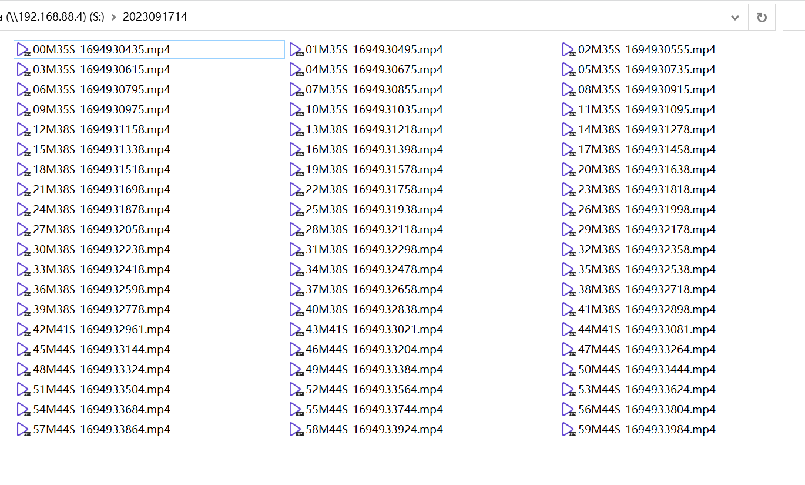
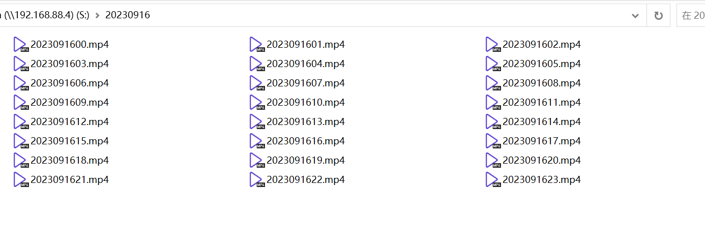

## 项目背景

- 家中小米摄像头视频存储于NAS中，每个文件夹以小时（yyyyMMddHH）为单位，文件夹中存储视频以分钟为单位录制，每个视频文件只记录一分钟的内容，不便于回放。
- 建立该项目，将同一小时的视频合并为一个文件，以日期命名（yyyy-MM-dd）新文件夹，存储当天24小时的视频
- 合并完成后，删除源视频及目录
- 每小时执行一次

## 完成效果

- 原小米摄像机同步到NAS效果
  

- 视频合并后效果
  

## 下载ffmpeg

[下载ffmpeg](https://ffmpeg.org/download.html)

## Windows

### 设置环境变量

将 `ffmpeg.exe` 所属目录添加到环境变量 `Path` 中

### 转换

``` bash
# -i 指定文件名
ffmpeg -safe 0 -f concat -i C:\micamera\2023091417\2023091417.txt -c:v copy -c:a aac C:\micamera\2023091417.mp4

```

## Linux（Debian）

``` bash
# 从官方源中安装ffmpeg
apt-get install -y ffmpeg
```

## Docker

``` bash
# 绑定本地 /micamera 目录到Docker容器的 /app/videos 目录
docker run -itd \
--name video-merge \
--restart always \
-v /micamera:/app/videos \
programmerzheng/video-merge
```

### 其他链接

- https://gist.github.com/ratulbasak/b1297ac3f6c5ef429937006feff929e4
- https://stackoverflow.com/questions/72452823/package-is-installed-inside-docker-but-actual-command-provide-exception
- https://medium.com/@ratulbasak93/ffmpeg-latest-in-docker-or-ubuntu-16-04-4bd7ea750ca1
- https://stackoverflow.com/questions/44874439/run-bash-command-from-netcore-with-arguments