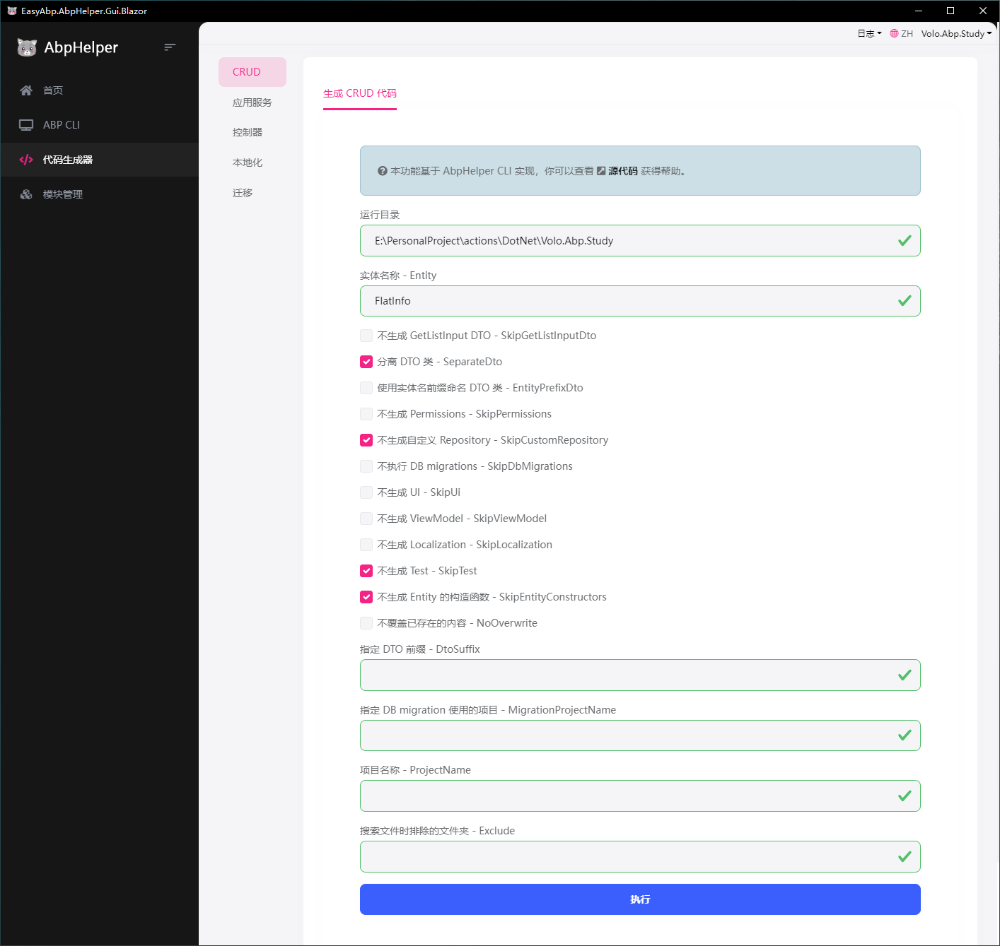

# AbpHelper使用

### 项目地址

[EasyAbp/AbpHelper.GUI: Providing code generation and more features to help you develop applications and modules with the ABP framework. (github.com)](https://github.com/EasyAbp/AbpHelper.GUI)

### 本地配置

